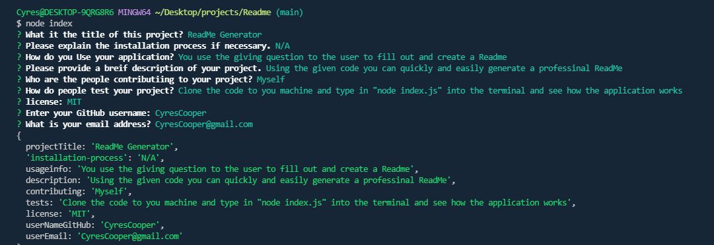

## ReadME-generator

# Description 
This application was created to reduce the time and effort used in creating a professional styled ReadMe. This application asks a series of question  following the given prompts. The application is ran throught the command line using Node.js along with making sure the inquirer package was used.

# Demos 
Listed below are a few examples of how the application will work the link provided is a viedo showing an example of how the application works from the command line and actually generating the ReadMe.\
The first photo shows what the application will look like when ran sucessfully within the commandline.\
The scond photo show what the new ReadMe file that was auto generated will look like.\

https://user-images.githubusercontent.com/95892453/157145742-1934a2b8-6a91-4a9d-bfce-ed32d562e564.mp4

