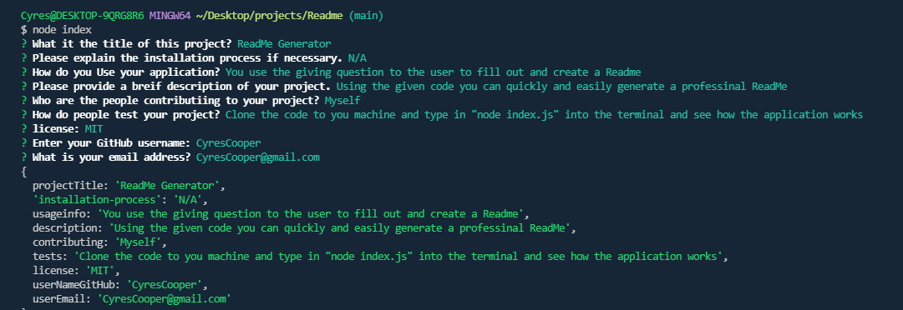
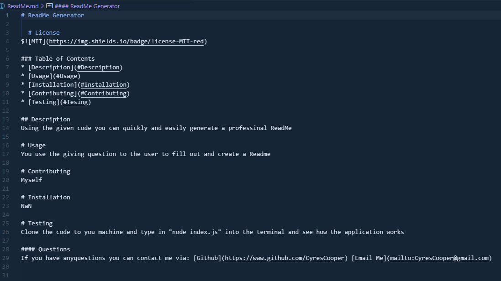

# ReadMe Generator
  
  # License

  
### Table of Contents
* [Description](#Description)
* [Usage](#Usage)
* [Installation](#Installation)
* [Contributing](#Contributing)
* [Testing](#Tesing)
   
## Description
Using the given code you can quickly and easily generate a professinal ReadMe
  
# Usage
You use the given questions to the user so they can  fill out and create a Readme from the terminal and it comes out auto formated

# Contributing
Myself

# Installation
NaN
 
# Testing
Clone the code to you machine and type in "node index.js" into the terminal and see how the application works
  
#### Questions
If you have anyquestions you can contact me via: [Github](https://www.github.com/CyresCooper) [Email Me](mailto:CyresCooper@gmail.com)

## Demo 
[viedo link](https://drive.google.com/file/d/1Gq0RPnsx1FauA9GXLwcBSbve16CK0Mp6/view)

  
